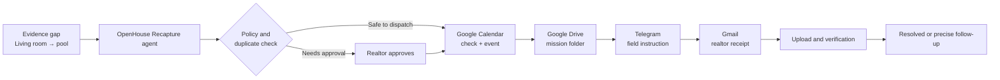

# OpenHouse Recapture

**One missing 20-second proof can stop a property from being ready for the marketplaces where buyers already search. OpenHouse Recapture turns that gap into one precise, auditable field mission.**

> **Two-minute demo:** Add the final public video URL here before submitting.
> **System and reliability brief:** [`docs/submission-brief.md`](./docs/submission-brief.md)

It is a multi-step operations agent for small real-estate teams. Starting from a bounded media-evidence gap, it writes a specific recapture instruction, applies a deterministic policy, coordinates the field handoff, and keeps a durable record of every outcome.

## The workflow



The product is an upstream quality and operations layer. It does **not** claim to generate a universal Zillow or Airbnb 3D file. It helps a realtor obtain the specific, usable evidence needed before publishing to the channels they use.

## Multi-app integrations

| App | Action | Why it matters |
| --- | --- | --- |
| Google Calendar | Checks the proposed slot and creates the recapture event | Prevents a field task being booked blindly |
| Google Drive | Creates the mission folder for the new footage | Keeps evidence tied to the mission |
| Telegram | Delivers the exact field instruction to the photographer | Gives the person on site a useful, concise task |
| Gmail | Sends the realtor a durable summary and receipt | Keeps the accountable owner informed |

The server-side agent also uses Gemini when configured to turn the bounded gap into a concise field instruction. Deterministic policy—not model prose—decides whether a mission is blocking, duplicate, approval-gated, or safe to dispatch.

## What is real vs. what needs credentials

- The mission state machine, idempotency key, access checks, approval gate, audit log, and UI are implemented in this repository.
- The Google bridge in [`integrations/google-apps-script`](./integrations/google-apps-script) performs real Calendar, Drive, and Gmail actions when deployed under a team Google account. Telegram is a direct Bot API connector when its server-side secrets are configured.
- `RECAPTURE_CONNECTOR_MODE=demo` produces visibly simulated receipts so the product can be rehearsed without sending messages or creating appointments. Do not present demo receipts as external side effects.

## Local setup

```bash
npm install
npm run dev
```

Create `.env.local` from `.env.example` and provide a **separate** Supabase project for this hackathon copy. Browser code only needs the public Supabase URL and anon key. All connector and model credentials belong in Supabase Edge Function secrets.

Apply the migration and deploy the new function:

```bash
npx supabase db push
npx supabase functions deploy openhouse-recapture --no-verify-jwt
```

The copied original OpenHouse project is intentionally separate from this repository and is not modified by these instructions.

### Demo mode for judges

For a safe, self-contained walkthrough that does not create an external
calendar event or send a message, run with:

```text
VITE_OPENHOUSE_MODE=demo
```

Use **Quick demo login**, then open **Recapture agent** from the sidebar. The
screen explicitly labels its connector receipts as simulated. See
[`docs/judge-demo.md`](./docs/judge-demo.md) for separate demo and production
deployment guidance.

## Reliability evidence

Run `npm run evaluate:recapture` for the deterministic policy-contract set.
The full methodology and the live-connector checklist are in
[`docs/recapture-evaluation.md`](./docs/recapture-evaluation.md). It tests the
conditions that make this an agent rather than a notification script: safe
scheduling, duplicate prevention, escalation, and honest resolution decisions.
Run live connector checks before quoting any provider-delivery result in a demo
or submission.

## Hackathon demo in one sentence

> A property is ready for Zillow, Airbnb, or the MLS—but one missing 20-second proof is holding it back. OpenHouse Recapture gets the exact footage, from the right person, at the right time, with an audit trail.

## Foundation disclosure

OpenHouse’s property workspace and evidence data model were an existing foundation. The Recapture agent layer—the durable mission schema, policy and idempotency logic, connector orchestration, external receipts, audit trace, and evaluation suite—is the hackathon work in this repository.
